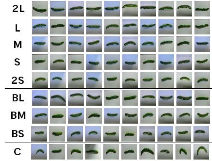
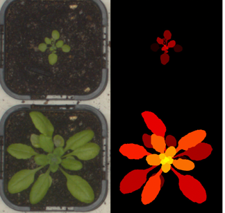
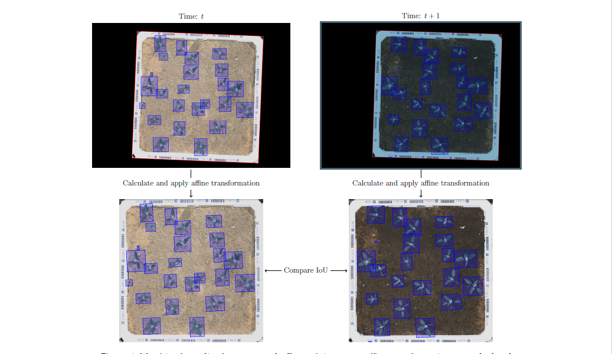
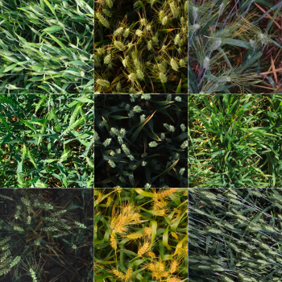

# Image-Analysis for Plant Biologists with Python

## Table of Contents
- [はじめに](columns/introduction.md)
- ハンズオン
  - 画像解析基礎
    - イネ種子形状解析 (binarization, regionpropsの使い方)
    - 花粉染色定量解析
    - ぶどうの葉の形状解析（楕円フーリエ）
    - りんごの葉の形状解析と遺伝情報とのリンケージ（EFD、PH、他遺伝情報解析）
  - 応用編
    - 気孔検出（HOG、YOLOX）
    - [植物病害識別診断](notebooks/plantvilllage.ipynb)（PlantVillage, CNN）
      - おまけGrad-CAM、guided backpropagationによる可視化
    - Object Detection
      - Wheat head detection?
    - Semantic Segmentation
      - Weed Segmenatation (pytorch segmentationあたりを使いたい)
    - Instance Segmenatation
  - ???
  - 
    - PlantSegを利用した3D共焦点画像解析
    - [U2-Net (U-Square Net)を利用した葉領域抽出](notebooks/u2netp.ipynb)
- おまけ？
  - Segment Anything
  - Grounding DINO
- 参考資料集
  - オンラインで便利なpython講座・資料まとめ
    - リンク集にするか解説をつけるかは後で考える。
    - http://mdsc.kyushu-u.ac.jp/lectures
    - https://amorphous.tf.chiba-u.jp/lecture.files/chem_computer/index.html
    - https://repository.kulib.kyoto-u.ac.jp/dspace/handle/2433/245698
    - https://utokyo-ipp.github.io/course/
    - 

  - 使えそうな植物データセット一覧
- コラム
  - 座標系:xyなのかyxなのかrcなのか
  - [安直になんでもかんでもAIと呼ぶんじゃない](columns/using_the_term_AI.md)
  - [ファイルとフォルダ名の命名規則について](columns/file_name.md)
  - [レナを超えて](columns/lenna.md)
  - 植物データセット作成は難しい

##memo

### Plant Phenotyping Themesアイディア
- U-Net
- きゅうりの形状解析
  - cc by
    - https://github.com/workpiles/CUCUMBER-9
    - 
- イネ種子の割れ米分類
  - classical, svm, cnn
- 葉や果実の形状解析
  - 楕円フーリエ記述子を使ったクラスタリング、潜在空間へのマッピング
  - 
  - 
- 植物病害クラス分類 (PlantVillage)
  - CNN学習
    - keras sequential API?を使ってcnnを自分で書いてみる
    - 特徴量の可視化
- Arabidopsis leaf segmentation
  - https://zenodo.org/record/168158
  - cc by attribution
  - 
- 植物病斑物体検出（PlantDoc）
  - yolo-x
  - yolov8
- 領域分割（Arabidopsis Leaf Dataset）
  - unet
- 顕微鏡画像解析がなにか１つほしい
  - ためしげさん　気孔
    - detectron2?
- ドローンの物体検出植物
  - https://www.mdpi.com/2072-4292/12/8/1246
  - ccby4.0
  - 
- 小麦穂検出（global wheat dataset challenge）
  - 
  - LICENSEを確認
    - yolov8? 
    - kaggleの使い方
- VegAnn
  - https://www.nature.com/articles/s41597-023-02098-y
  - ccby4.0
### 応用
- 葉脈パターンのグラフ変換と種分類
  - https://www.jstage.jst.go.jp/article/jsbbs/72/1/72_21078/_article/-char/ja/

### Common Dataset Format
- COCO Format
- PASCAL VOC Format
- TFDataset

### おまけ
- u2netによる背景除去
- Foundation modelを活用したゼロショット推論
- colab以外の実装形態
  - .pyファイル
  - ウェブ形式
    - streamlit, gradio ....

    メモ
    - 