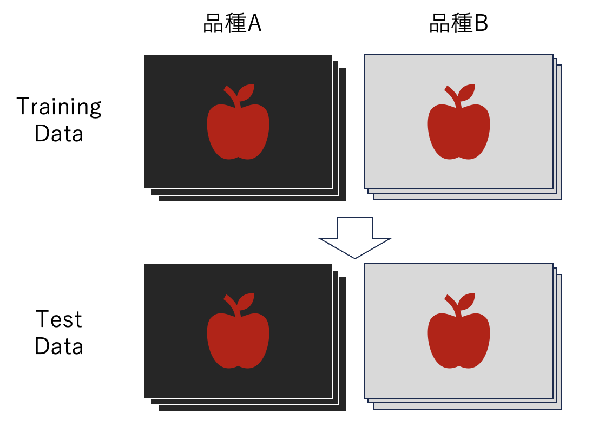

# データリーク

## データリークとは

データリークとは、機械学習モデルの訓練時に、本来は利用すべきでない（してはならない）情報がモデルに利用されてしまう現象を指します。これは、データに付随する注釈情報（メタデータ）から中身が推測できてしまったり、テストデータに関する情報が訓練データに混入してしまったりすることで発生します。

データリークはモデルの性能評価を過大評価する原因となり、実際の運用時には期待した性能が（全く）出ないという問題を引き起こします。これは、モデルが本来学習すべき特徴ではなく、リークした情報を学習してしまうためです。

データリークを防ぐためには、データセット作成時にその処理や分割方法に注意を十分に払うことが必要です。

## データリークの例

### 解析対象以外の画像情報から対象物の情報を推定できてしまう場合

リンゴの品種分類を考えてみましょう。品種Aと品種Bの視覚的な差は微細で、篤農家でないと精度良く判別できません。あなたはこれら品種を分類するモデルを作りたいとし、データを収集することにしました。例えば、品種Aを黒い布で撮影し、品種Bを白い布で撮影した画像を集めてデータセットを（意図せず）作成し、モデルを作成するとどうなるでしょうか？この場合、背景情報のみで品種を推定する機械学習モデルが作成されてしまい、分類精度100%近くとなる"優秀な"モデルとなります。しかしながら実際の品種判別において背景色は意味のないものであり、実世界では使い物にならないことは容易に想像できます。このような場合、「背景情報がリークしてしまった」と表現することができます。



ここでは背景の色違いという極端な例を示しましたが、現実世界では下に示すような微細な差もデータリークの要因となります。

- 背景の違い
  - 背景の素材の違い
  - 背景の汚れ
- 照明
  - 光量
  - 配置（≒影の方向）
  - 撮影時間帯（外環境の場合、環境光の光量や色）
- データ撮影機器
  - カメラの機種の違い
  - 撮影解像度
  - カメラの撮影距離

このような要素は、撮影環境を厳密に均一にするか、逆に多様性をもたせる（両条件とも様々な環境でデータを取得する）ことで回避することができます。

### ファイル名からデータの中身が推測できてしまう場合

上述の問題を対策でき、撮影を始めたとします。ただし、あなたが使用した撮影装置の設定が、撮影日時をファイル名として記録するようになっていたとしましょう。このままデータセットを作成すると、それもまたデータリークの原因となります。作成したデータセットの構造を見てみると明らかです。

```shell
├── train_data
│   ├── classA
│   │   ├── 202301021134.jpg
│   │   ├── 202301021135.jpg
│   │   └── 202301021136.jpg
│   └── classB
│       ├── 202301031134.jpg
│       ├── 202301031135.jpg
│       └── 202301031136.jpg
└── test_data
    ├── classA
    │   ├── 202301021137.jpg
    │   ├── 202301021138.jpg
    │   └── 202301021139.jpg
    └── classB
        ├── 202301031137.jpg
        ├── 202301031138.jpg
        └── 202301031139.jpg
```

これを見て、品種Aは2023年1月2日に撮影し、品種Bは2023年1月3日に撮影したと容易に推測できるでしょう。訓練すべき分類モデルにファイル名を説明変数として加えれば（あるいはもっと単純にファイル名だけで判定するアルゴリズムを作れば）、見かけ上分類精度100%のモデルが作れてしまいます。

たとえ同日に２品種を撮影したとしても撮影順序に規則性があれば同様に推定できてしまうこともあります。このような問題に対応するため、ファイル名がリークとなりうるようなデータセットではファイル名がランダム値（もしくはデータコンテントから計算されたhash値）に置き換えられていることもあります。

```shell
9570ee29fb2a32b45a45d8e8bb0fda5b.jpg
```

「テストデータのファイル名なんて見なきゃいいじゃん」

時と場合によっては、その考えでも問題ないでしょう。ただし、生物学実験で置き換えたらどうでしょうか？実験を行うとき、ブラインド（もしくはダブルブラインド）で行う必要がある場合があることを踏まえると、考慮しなければいけない状況が理解しやすいかもしれません。

また、このようなデータリークが重要になってくるのはコンペティション（競技）です。参加者は順位を競うため、使えるデータは何でも使います（そしてそれはレギュレーション内であれば全く正常かつ正当な行為です）。データリークがあれば、リークされた情報をもとに精度を競う合うことになり、主催者が期待したコンペティションの目的とは乖離してしまいます。結果、主催者、競技者ともに時間を無駄にすることになってしまいます。

ただし、リークが必ずしも悪かと言われるとそうではなく、状況に依存します。
例えば、日本に生息する、ある生物種の画像の分類に関するデータセットを作成していて、写真のExif情報（撮影日時や撮影場所などのメタデータが格納されている）からリークが起きたとします。画像分類問題としては体をなさなくなってしまいますが、その情報をもとに、ある生物の生息域に関する発見につながることもありえるからです。

## 過去に実際に起きたデータリーク

### 果実の外観分類コンペ

ある果実の等級を推定するという画像分類コンペが開催されました　（<https://signate.jp/competitions/431>）。そこで公開されたデータセットにおいて、２種類のデータリークが確認されました。>

- テストデータにある果実と訓練データにある果実が同一個体由来であり、撮影角度を変えただけのものが一部混入していた。
- ファイル名が撮影日時であり、さらに上記の情報とあわせるとテスト画像の撮影時間帯から撮影した等級がある程度推測できてしまった。

### 乳がん検出コンペ

胸部X線写真から初期乳がんを検出するアルゴリズムを競うコンペでは、データに割り振られた匿名患者の固有ID(patient_id)からデータリークが置きました。具体的には、patient_idをランダム化せず、連番で作成したため、番号の並びから結果の推測ができてしまうといったリークでした（例えば、pateint_idの大きい番号に実際のがん患者の写真が集中していた、など）。

Winner’s Report: KDD CUP Breast Cancer Identification. Claudia Perlich et al., 2008, ACM SIGKDD Explorations Newsletter.
