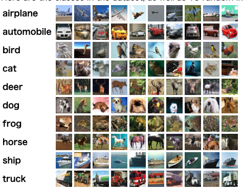

# 機械学習におけるデータセットのフォーマット

機械学習を利用した画像解析において、モデルの訓練のためには規格化されたデータセットは（多くの場合）必須となります。そのとき、訓練するモデルやライブラリが、どのようなデータセットフォーマットを要求しているかを理解するのはとても重要です。ここでは、訓練したい機械学習モデルごとに必要となるデータセット（画像とラベルデータ）のフォーマットについて紹介します。

## 画像分類



画像が何を意味しているのか分類（診断）する、いわゆるClassificationタスクのモデルを訓練するためには画像と分類するカテゴリーを示すラベルが必要です。特に、クラスラベルは通常、下に示すようにワンホットエンコーディングされた形式として表されます。

物体検出

### COCO (Common Objects in Context)

フォーマット: JSON

構成: 画像とjsonファイルから成り立ちます。

#### データセット構造の一例

```shell
dataset/
├── annotations
│   ├── train.json
│   └── validation.json
└── images/
    ├── image1.jpg
    ├── image2.jpg
    └── ...
```

#### アノテーションファイルの記述方法

（物体検出に限定した例示）

bboxキーに物体の位置を記述します。

x（bbox左上のx座標）, y（bbox左上のy座標）, width（bboxの幅）, height（bboxの高さ）となります。

```python
coco_data = {
    "images": [
        {
            "id": 1,
            "file_name": "image1.jpg",
            "width": 640,
            "height": 480
        },
        # ... (他の画像)
    ],
    "annotations": [
        {
            "id": 1,
            "image_id": 1,
            "category_id": 1,
            "bbox": [50, 50, 100, 100],  # [x, y, width, height]
        },
        # ... (他のアノテーション)
    ],
    "categories": [
        {
            "id": 1,
            "name": "person",
        },
        # ... (他のカテゴリ)
    ]
}
```

### YOLO (Darknet)

フォーマット: txt

構成: 画像とtxtファイルのペアから成り立ちます。

#### データセット構造の一例

```shell
dataset/
├── images/
│   ├── image1.jpg
│   ├── image2.jpg
│   └── ...
└── labels/
    ├── image1.txt
    ├── image2.txt
    └── ...
```

#### アノテーションファイルの記述方法

下記はimage1.jpgにアノテートされた物体情報です。

１オブジェクトにつき、一行の物体情報が記述されます。

左から順に、ラベル種類を番号で表したもの、xy座標（bboxの中心座標を画像の幅と高さでそれぞれ割り、0-1の値となるよう正規化したもの）、width, height（同様に、bboxの幅と高さを画像の幅と高さで割って正規化したもの）

```plaintext
0 0.5 0.5 0.25 0.25 
3 0.7 0.7 0.2 0.2
```

# ImageNet

フォーマット: XML

構成: 画像とxmlファイルのペアから成り立ちます。

### データセット構造の一例

```shell
dataset/
├── Annotations/
│   ├── image1.xml
│   ├── image2.xml
│   └── ...
└── JPEGImages/
    ├── image1.jpg
    ├── image2.jpg
    └── ...
```

### アノテーションファイルの記述方式

オブジェクト情報を\<object>\</object>で定義します。

xmin, ymin, xmax, ymaxは、bboxの左上と右下座標のxyに対応します。

```xml
<!-- image1.xml -->
<annotation>
    <folder>JPEGImages</folder>
    <filename>image1.jpg</filename>
    <size>
        <width>640</width>
        <height>480</height>
        <depth>3</depth>
    </size>
    <object>
        <name>dog</name>
        <bndbox>
            <xmin>50</xmin>
            <ymin>50</ymin>
            <xmax>150</xmax>
            <ymax>150</ymax>
        </bndbox>
    </object>
    <!-- .... -->
</annotation>
```

これらのフォーマットを活用することで、機械学習タスクを効率的に行えるようにします。しかし、異なるプロジェクトやツールでは、異なるフォーマットが必要になる場合があります。この問題を解決するために、フォーマットコンバージョンツールやサービスが提供されています。

例えば、Roboflow (https://roboflow.com/) は、異なるデータセットフォーマット間での変換と最適化をサポートする便利なプラットフォームです。これにより、データセットを効率的に管理し、さまざまな機械学習プロジェクト間で移行することが簡単になります。正しいフォーマットとツールを選択することで、プロジェクトの効率を大いに向上させることができます。
