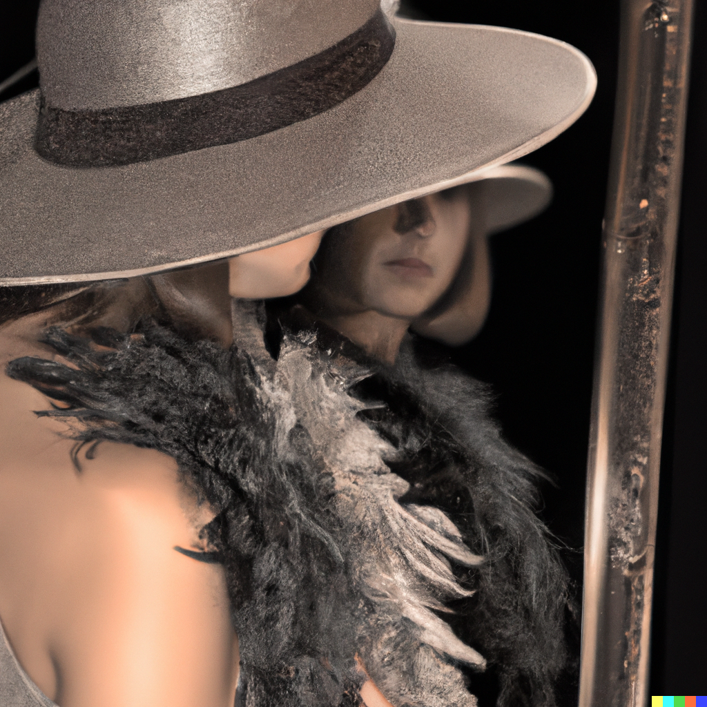

# 「レナ」を超えて

コンピュータビジョンやデジタル画像処理の分野で、レナ（Lena/Lenna）の画像は非常に一般的なテスト画像として長年にわたり使用されてきました。この画像はスウェーデンのモデル、レナ・フォルセンの写真で、1972年11月号プレイボーイ誌から切り取りスキャンされ、デジタル化されたことから始まります1。

ある日、南カリフォルニア大学の画像処理研究所の研究者が、画像処理アルゴリズムを試すための新しい画像を探していました。彼らが求めていたのは、画像処理に適した色合いであり、さらには人間の顔がうつっていることでした。そんな時、ラボ内にあった"色鮮やかな"プレイボーイ誌の写真を使うことに決めたのです。

レナの画像が一般的なテスト画像として広く受け入れられた理由としては、その詳細さ、平坦な領域、陰影、テクスチャが挙げられます。これらの特性は、画像処理アルゴリズムの性能を評価する上で重要であるためです。（当時、主に男性で構成されていた画像処理コミュニティにおいて"うける"画像であったことも一因であったのでしょう）。

近年、「性的魅力を発信する目的である雑誌から写真を引用することは不適切である」といった意見や、「男性中心の技術分野であること印象を強化してしまう」といった懸念が出始めました。さらにはモデルとなったレナ・フォルセン自身が「とうの昔に女優業は引退しました。"技術"の分野からも引退すべき時でしょう」と表明したこともあり2、今ではレナ画像の使用は推奨されなくなっています。（ただし、レナ自身は写真を使用されたこと自体は光栄だったとも同時に述べています。）

注意すべきこととして、画像処理ドメインではそのような歴史的経緯が常識のように共有されているものの、ドメイン外では必ずしもそうではないことです。みなさまにおかれましては、うかつに使用してジャーナルや共同研究者から信用をなくさないよう留意しましょう。

オリジナル画像を添付することはできないため、代替となる絵を置いておきます。レナの画像を状況説明文に変換し3、その説明文をもとに絵を生成する4ことによって作成されました。幾度かパラメーターの調整をしましたが意図した絵にはなかなかなりません。生成AIは難しいですね。

1. <https://www.bbc.com/news/technology-19260550>
2. <https://www.sfgate.com/news/article/How-a-Nude-Playboy-Photo-Became-a-Fixture-14878319.php>
3. <https://huggingface.co/Cxxs/ImageBind-LLM>
4. <https://openai.com/dall-e-2>

## 2024年4月30日追記

既に2018年12月には、Nature誌（姉妹誌を含む）は今後一切のレナ画像の使用を禁止すると発表していました5。2024年4月、電気・情報工学分野の学術研究団体IEEE Computer Societyもレナ画像の使用を正式に使用禁止することを発表しました６。このような動きは今後も広がることが予想され、それにより、レナ画像の使用はますます減少していくでしょう。

5. A note on the Lena image. Nature Nanotech 13, 1087 (2018). <https://doi.org/10.1038/s41565-018-0337-2>

6. <https://arstechnica.com/information-technology/2024/03/playboy-image-from-1972-gets-ban-from-ieee-computer-journals/>
