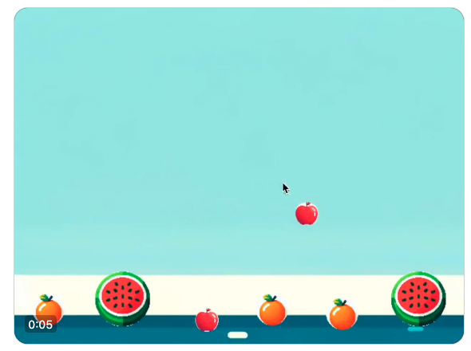
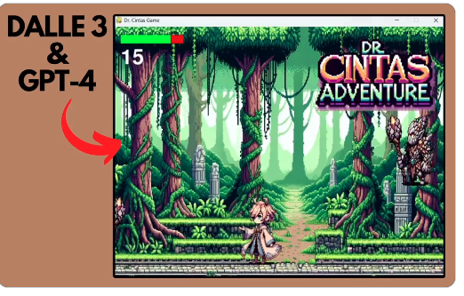

# 大規模言語モデルを利用したプログラミングの支援

ChatGPTを始めとする大規模言語モデル（Large Language Model; LLM）を活用すると、コーディングのアシスト、もしくは完全代行させることができるのではないかと期待されています。例えば2023/11/14時点でのChatGPT4を利用して種子計数形状解析（１）にて使用したイネ種子画像の粒数計測のプログラムを生成させてみましょう。


## 人間側の指示（プロンプト）

This image visualizes hundreds of rice seeds on a black background. I want to count how many seeds there are. Build a program for me, along with the counted results calculated.

## AI側の出力

```python
from PIL import Image
import numpy as np
import cv2

# Load the image
image_path = '/mnt/data/rice.jpg'
original_image = cv2.imread(image_path)
# Convert the image to gray scale
gray_image = cv2.cvtColor(original_image, cv2.COLOR_BGR2GRAY)
# Use a Gaussian blur to reduce noise and improve edge detection
blurred_image = cv2.GaussianBlur(gray_image, (5, 5), 0)
# Perform edge detection
edged_image = cv2.Canny(blurred_image, 50, 100)
# Perform a dilation + erosion to close gaps in between object edges
dilated_image = cv2.dilate(edged_image, None, iterations=2)
eroded_image = cv2.erode(dilated_image, None, iterations=1)
# Find contours in the edged image
contours, _ = cv2.findContours(eroded_image.copy(), cv2.RETR_EXTERNAL, cv2.CHAIN_APPROX_SIMPLE)
# Count the number of contours found which should correspond to the number of rice seeds
rice_count = len(contours)
rice_count
```

```shell
15
```

The program counted 15 rice seeds in the image. However, this result seems to be unexpectedly low for the number of seeds visible in the image. The image processing algorithm might not have been able to accurately distinguish between individual seeds if they are very close to each other or overlapping, or the parameters for contour detection might need to be adjusted for better accuracy.

## 改良した人間側の指示（プロンプト）


このように、少なくとも現状では完全にAIに任せることは難しく、人間との対話や指示・管理が重要です。人間（指示側）に必要なスキルをいくつかの項目に分けてリストアップすると以下のようになります。

## 要件定義能力

プロジェクトの目的、期待される成果物、使用する技術やフレームワークなどを明確に伝える能力が必要です。

## 具体的な説明能力

抽象的なアイデアを具体的な指示や仕様に落とし込む能力。特に、AIに対しては、細部まで丁寧に説明する必要があります。
技術的な知識:

プログラミング言語、フレームワーク、アルゴリズム、データベースなどの基本的な知識が求められます。

## コミュニケーションスキル:

AIに対する指示だけでなく、得られた結果を理解し、必要に応じて指示を修正するためのスキル。

## 問題解決能力:

AIが提供する解決策に問題がある場合、それを特定し、適切な指示を出す能力。
プロジェクト管理能力:

進捗管理、タスクの優先順位付け、時間管理などのプロジェクト管理スキル。

## 柔軟な思考力:

AIが提案する解決策を理解し、必要に応じて新しいアプローチを考える能力。

## 品質管理能力:

AIが作成したコードの品質を評価し、必要に応じて改善指示を出す能力。
これらのスキルは、AIと協力して効率的にプログラミング作業を進めるために重要です。AIが進化し、より多くのタスクを自動化するにつれて、これらのスキルの重要性はさらに高まるでしょう。

<br>

<center></center>
<blockquote class="twitter-tweet"><p lang="ja" dir="ltr">Cursor, ChatGPT, GPT-4, DALL-E3を使ったら、今まで一度もゲーム作ったことなかったけど、1時間でスイカゲーム（らしきもの）が出来た。 <a href="https://t.co/zomsO6HIDw">pic.twitter.com/zomsO6HIDw</a></p>&mdash; 元木大介@Cursorコネクト/ CalqWorks (@ai_syacho) <a href="https://twitter.com/ai_syacho/status/1723067874254758332?ref_src=twsrc%5Etfw">November 10, 2023</a></blockquote> <script async src="https://platform.twitter.com/widgets.js" charset="utf-8"></script>

<br>
<center></center>

<blockquote class="twitter-tweet"><p lang="en" dir="ltr">DALL•E 3 and GPT-4 have opened a world of endless possibilities.<br><br>I just coded this game using DALL•E 3 for all the graphics and GPT-4 for all the coding. <br><br>Here are the prompts and the process I followed: <a href="https://t.co/EHepJDBUVq">pic.twitter.com/EHepJDBUVq</a></p>&mdash; Alvaro Cintas (@dr_cintas) <a href="https://twitter.com/dr_cintas/status/1712179990144426442?ref_src=twsrc%5Etfw">October 11, 2023</a></blockquote> <script async src="https://platform.twitter.com/widgets.js" charset="utf-8"></script>

<br>
ChatGPTによるプログラムコード生成とDALLE3による画像生成を組み合わせ、ゲームを作ることも可能な時代となってきた。