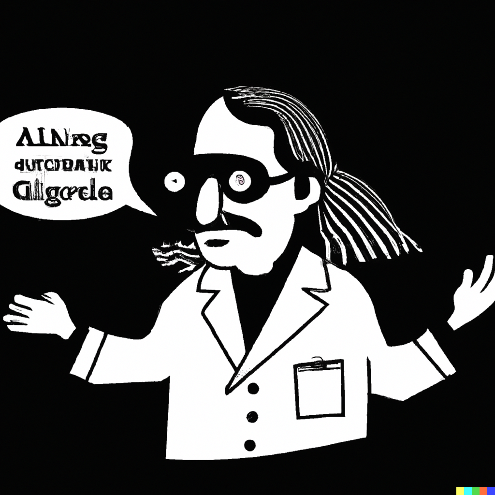

# AIという言葉の使い方：研究者が留意すべき点
皆さんは、「AIを活用した〜」や、「〜について説明可能なAI」といった表現を耳にしたことが多々あるかと思います。しかし、これらの表現は必ずしも正確ではないことがあります。特に、植物科学や農学の分野で活用される画像解析技術において、ニューラルネットワーク重要な役割を果たしていますが、これらを安易に「AI」などと呼ぶことは、科学者として注意が必要です。

一般の人々に対する情報提供や啓発活動（アウトリーチ）では、このような言葉が理解しやすく、有用かもしれません。しかし、科学コミュニティ内では、これらの用語の使い方が正確でないと誤解を招く恐れがあります。例えば、「AIを活用した」はどのような技術が使われているのかが不明確であり、「〜について説明可能なAI」も、どの程度の解析ができるのか曖昧です。これらの表現は、煙に巻くような印象を与え、誇大広告のように映る可能性もあるため、注意が必要です。

また、用語を適当に使ってしまうと、その言葉自体が消耗し、重要性が薄れてしまうことがあります。科学的な知見が更新されるにつれ、新しい"AI"技術が登場した時には、その重要性が適切に伝えられなくなってしまうかもしれません。

さらに、近年のAIの進化は目覚ましく、特に基盤モデルや大規模言語モデルの性能向上が顕著です。そのような新技術を単なるAIではなく、「AGI（Artificial General Intelligence：人間のような広範な知識と能力を持つAI）」と呼ぶべきなのではないかという議論が出ています。しかし、データサイエンスの専門家の中には、これもまた早計であるとし、慎重に用語を使うべきだという意見もあります。

これらを踏まえて、植物科学者や農学者として、AIという言葉や関連する用語を使う際は、その意味や背景を理解し、正確さを重視する姿勢が求められます。それが、我々の研究が社会に信頼され、広く受け入れられるための鍵となるのです。

なお、本コラムはChatGPT4の補助によって執筆しました。AIって便利ですね。

</img>
*AIがどんなことでも実現してくれると盲信しているが、結局は予算取りの道具としてしか使っていない研究者*。DALLE-21で生成。

1. https://openai.com/dall-e-2